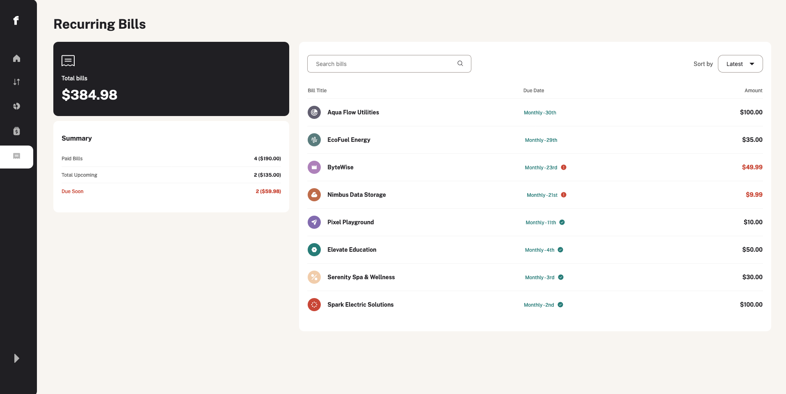

# Frontend Mentor - Personal finance app solution

This is a solution to the [Personal finance app challenge on Frontend Mentor](https://www.frontendmentor.io/challenges/personal-finance-app-JfjtZgyMt1). Frontend Mentor challenges help you improve your coding skills by building realistic projects.

## Table of contents

- [Overview](#overview)
  - [The challenge](#the-challenge)
  - [Screenshot](#screenshot)
  - [Links](#links)
- [My process](#my-process)
  - [Built with](#built-with)
  - [What I learned](#what-i-learned)
  - [Continued development](#continued-development)
  - [Useful resources](#useful-resources)
- [Author](#author)
- [Acknowledgments](#acknowledgments)

## Overview

### The challenge

The app allows users to manage their personal finances with a variety of features:

- Overview page showing all data at-a-glance
- Transactions page with pagination and options to search, sort, and filter
- CRUD operations for budgets and saving pots
- Viewing progress toward saving goals
- Adding and withdrawing money from saving pots
- Managing recurring bills with sorting and searching options
- Navigation and actions accessible via keyboard
- Responsive design adaptable to various screen sizes

### Screenshot




### Links

- Solution URL: [Github URL](https://github.com/richard9809/personal-finance-app-reactjs)
- Live Site URL: [Live Site URL](https://wonderful-florentine-718eb3.netlify.app/)

## My process

### Built with

- React - For interactive UI
- Styled Components - For component-level styling
- CSS Grid and Flexbox - For layout
- JavaScript - For dynamic interactions
- React Router - For navigation
- LocalStorage and Context API - For data persistence

### What I learned

Working on this project enhanced my understanding of React hooks, state management, and building accessible web applications. Here are some highlights:

- State Management: Used React’s state management effectively for data handling in CRUD operations across various components.
- Pagination and Filtering: Implemented custom pagination logic to load transactions in batches and efficient filtering for user convenience.
- Responsive Design: Employed CSS Grid and Flexbox for a mobile-first, responsive layout.

To see how you can add code snippets, see below:

```js
const totalPages = Math.ceil(sortedTransactions.length / transactionsPerPage);
const currentTransactions = sortedTransactions.slice(
  (currentPage - 1) * transactionsPerPage,
  currentPage * transactionsPerPage
);
```

### Continued development

In future projects, I aim to focus more on:

- Backend Integration: Expanding this app to a full-stack application by connecting a backend for persistent data storage.
- Improving Performance: Optimizing data handling and load times with caching strategies.
- Advanced State Management: Implementing Redux or Context API for more complex data flows in larger applications.

**Note: Delete this note and the content within this section and replace with your own plans for continued development.**

### Useful resources

- [Frontend Mentor Community](https://www.frontendmentor.io/community) - Great resource for tips and feedback on coding challenges.

## Author

- Website - [Richard Mulu Ndisya](https://wonderful-florentine-718eb3.netlify.app/)
- Frontend Mentor - [@richard9809](https://www.frontendmentor.io/profile/richard9809)

## Acknowledgments

Thanks to the Frontend Mentor community for helpful resources and support throughout the challenge.
